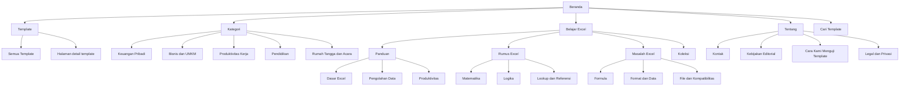

# Peta Hirarki Website ExcelGratis

Dokumen ini adalah gambaran arsitektur informasi situs untuk review internal. Ini bukan menu atau halaman baru di website.

## Jalur Pengguna Utama

1. Pengunjung yang sudah tahu kebutuhan file: `Beranda -> Template -> Kategori -> Detail Template -> Download`.
2. Pengunjung yang ingin belajar: `Beranda -> Belajar Excel -> Panduan/Rumus Excel/Masalah Excel -> Artikel`.
3. Pengunjung yang belum tahu jenis konten: `Footer -> HTML Sitemap` untuk daftar lengkap halaman publik.

## Navigasi Global

| Lokasi | Tujuan |
| --- | --- |
| Header desktop | Template, Kategori, Belajar Excel, Tentang, Cari |
| Navigasi bawah mobile | Beranda, Template, Cari, Kategori, Belajar Excel |
| Footer | Template dan kategori, Resource, Tentang, Legal, HTML Sitemap |

## Inventaris Publik Saat Ini

| Area | Isi publik |
| --- | --- |
| Template | 15 template pada Keuangan Pribadi, Bisnis dan UMKM, serta Produktivitas Kerja |
| Belajar Excel | 15 Panduan, 6 Rumus Excel, dan 6 artikel Masalah Excel |
| Koleksi | 3 koleksi resource |
| Draft | 20 template dan 15 panduan draft, sengaja tidak muncul pada route publik, navigasi, atau sitemap |

## Aturan Struktur

- `/belajar-excel/` adalah hub pembelajaran. `/panduan/`, `/rumus-excel/`, dan `/masalah-excel/` adalah arsip per jenis resource.
- Semua halaman detail harus dapat dicapai dari sebuah hub atau kategori publik.
- Konten draft tidak boleh tampil pada daftar, kartu terkait, route publik, atau sitemap.
- Saat jenis konten baru ditambahkan, peta ini dan audit discoverability perlu diperbarui sebelum rilis.
